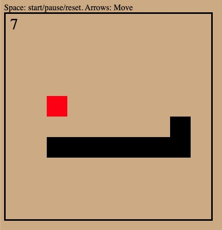
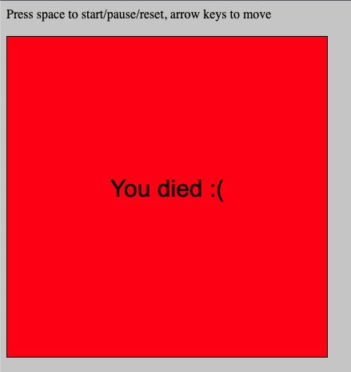

# URL Snake

A little experiement with seeing how complex of an app I can store entirely within a url.

The basic idea revolves around the fact that a data urls can define their encoding as text/html. 

i.e `data:text/html;charset=utf-8,hello%20world` is a valid url (try pasting it in your url bar). 

So is
`data:text/html;charset=utf-8,%3Cstyle%3E%20*%20%7B%20color%3A%20red%3B%20%7D%3C%2Fstyle%3EHello%20world!`. 

Aditionally, so is `data:text/html;charset=utf-8,%3Cstyle%3E%20*%20%7B%20color%3A%20red%3B%20%7D%3C%2Fstyle%3EHello%20world!%3Cscript%3Ealert(%22hello%20again!%22)%3B%3C%2Fscript%3E`.

So, if we can put html, css and js in a url and have that render a valid html page, how much of a page could we create?

## Result

I've come up with a 1040 byte solution that is a fully playable game of snake.

> ```let e=document,t=e.body,r=Math,l='Press space to start/pause/reset, arrow keys to move<br><br><canvas id="a"><style>canvas{border: 1px solid black;}body{background:#ccc;}</style>',i=40,o=400,n=o,s=0,f=1,d=0,c=1,h=0,p=[[3,3],[4,3],[5,3]],u=p,y=[5,5],b="#000",g=(e,t,r=b,l=i,o=i)=>{S.fillStyle=r,S.fillRect(e,t,l,o)},v=(e,t,r,l="center")=>{S.fillStyle=b,S.textAlign=l,S.fillText(e,t,r)},x=e=>r.floor(r.random()*e),k=()=>{if(!d&&!c){let[e,t]=p.pop(),r=p[0][0]+s,l=p[0][1]+f;if(r<0||9<r||l<0||9<l||p.some(([e,t])=>r==e&&l==t))return m();r==y[0]&&l==y[1]&&(h++,p.push([...p[p.length-1]]),y=[x(9),x(9)]),p.unshift([r,l]),g(0,0,"#fff",n,o);for([e,t]of p)g(e*i,t*i);g(y[0]*i,y[1]*i,"#0f0"),v("Score: "+h,n-10,30,"right")}},m=()=>{c=1,g(0,0,"#f00",n,o),v("You died :(",n/2,o/2)},w=()=>{c=0,p=[...u],s=0,h=0,f=1},S=(t.innerHTML=l,a.getContext("2d"));a.height=o,a.width=n,S.font="30px Arial",e.addEventListener("keyup",e=>{e=e.which;37==e&&(s=-1,f=0),38==e&&(s=0,f=-1),39==e&&(s=1,f=0),40==e&&(s=0,f=1),32==e&&(c?w():d=d?0:1)}),setInterval(k,500),k();```

Encoded as a url it is 1472 bytes long:

> ```data:text/html;charset=utf-8,%3Cbody%3E%3Cscript%3Eeval(atob(%22bGV0IGU9ZG9jdW1lbnQsdD1lLmJvZHkscj1NYXRoLGw9J1ByZXNzIHNwYWNlIHRvIHN0YXJ0L3BhdXNlL3Jlc2V0LCBhcnJvdyBrZXlzIHRvIG1vdmU8YnI+PGJyPjxjYW52YXMgaWQ9ImEiPjxzdHlsZT5jYW52YXN7Ym9yZGVyOiAxcHggc29saWQgYmxhY2s7fWJvZHl7YmFja2dyb3VuZDojY2NjO308L3N0eWxlPicsaT00MCxvPTQwMCxuPW8scz0wLGY9MSxkPTAsYz0xLGg9MCxwPVtbMywzXSxbNCwzXSxbNSwzXV0sdT1wLHk9WzUsNV0sYj0iIzAwMCIsZz0oZSx0LHI9YixsPWksbz1pKT0+e1MuZmlsbFN0eWxlPXIsUy5maWxsUmVjdChlLHQsbCxvKX0sdj0oZSx0LHIsbD0iY2VudGVyIik9PntTLmZpbGxTdHlsZT1iLFMudGV4dEFsaWduPWwsUy5maWxsVGV4dChlLHQscil9LHg9ZT0+ci5mbG9vcihyLnJhbmRvbSgpKmUpLGs9KCk9PntpZighZCYmIWMpe2xldFtlLHRdPXAucG9wKCkscj1wWzBdWzBdK3MsbD1wWzBdWzFdK2Y7aWYocjwwfHw5PHJ8fGw8MHx8OTxsfHxwLnNvbWUoKFtlLHRdKT0+cj09ZSYmbD09dCkpcmV0dXJuIG0oKTtyPT15WzBdJiZsPT15WzFdJiYoaCsrLHAucHVzaChbLi4ucFtwLmxlbmd0aC0xXV0pLHk9W3goOSkseCg5KV0pLHAudW5zaGlmdChbcixsXSksZygwLDAsIiNmZmYiLG4sbyk7Zm9yKFtlLHRdb2YgcClnKGUqaSx0KmkpO2coeVswXSppLHlbMV0qaSwiIzBmMCIpLHYoIlNjb3JlOiAiK2gsbi0xMCwzMCwicmlnaHQiKX19LG09KCk9PntjPTEsZygwLDAsIiNmMDAiLG4sbyksdigiWW91IGRpZWQgOigiLG4vMixvLzIpfSx3PSgpPT57Yz0wLHA9Wy4uLnVdLHM9MCxoPTAsZj0xfSxTPSh0LmlubmVySFRNTD1sLGEuZ2V0Q29udGV4dCgiMmQiKSk7YS5oZWlnaHQ9byxhLndpZHRoPW4sUy5mb250PSIzMHB4IEFyaWFsIixlLmFkZEV2ZW50TGlzdGVuZXIoImtleXVwIixlPT57ZT1lLndoaWNoOzM3PT1lJiYocz0tMSxmPTApLDM4PT1lJiYocz0wLGY9LTEpLDM5PT1lJiYocz0xLGY9MCksNDA9PWUmJihzPTAsZj0xKSwzMj09ZSYmKGM/dygpOmQ9ZD8wOjEpfSksc2V0SW50ZXJ2YWwoayw1MDApLGsoKTs=%22))%3C%2Fscript%3E```

<p align="center">
  
   
</p>

## Running the code

The game is built inside of `index.html`. `run.js` is a node script that takes that html file and encodes it as a url.

```
$ node run.js

data:text/html;charset=utf-8,%3Cbody%3E%3Cscript%3Eeval(atob(%22Y29uc3QgZD1kb2N1bWVudCxiPWQuYm9keSxhPWQuY3JlYXRlRWxlbWVudCgiY2FudmFzIiksYz1hLmdldENvbnRleHQoIjJkIik7Yi5hcHBlbmQoYSksYy5oZWlnaHQ9NDAwLGMud2lkdGg9NDAwLGMucmVjdCgwLDAsMTAwLDEwMCksYy5zdHJva2UoKTs=%22))%3C%2Fscript%3E
```

You can get some debugging information by passing the DEBUG flag

```
$ DEBUG=a node run.js
{
  js: 'const d=document,\n' +
    '    b=d.body,\n' +
    "    a=d.createElement('canvas'),\n" +
    '    c = a.getContext("2d");\n' +
    '  b.append(a)\n' +
    '  c.height = 400;\n' +
    '  c.width = 400;\n' +
    '  c.rect(0,0,100,100);\n' +
    '  c.stroke();',
  minified: 'const d=document,b=d.body,a=d.createElement("canvas"),c=a.getContext("2d");b.append(a),c.height=400,c.width=400,c.rect(0,0,100,100),c.stroke();',
  codeLength: 178,
  minifiedLength: 143,
  minSaved: 35,
  urlLength: 276
}
data:text/html;charset=utf-8,%3Cbody%3E%3Cscript%3Eeval(atob(%22Y29uc3QgZD1kb2N1bWVudCxiPWQuYm9keSxhPWQuY3JlYXRlRWxlbWVudCgiY2FudmFzIiksYz1hLmdldENvbnRleHQoIjJkIik7Yi5hcHBlbmQoYSksYy5oZWlnaHQ9NDAwLGMud2lkdGg9NDAwLGMucmVjdCgwLDAsMTAwLDEwMCksYy5zdHJva2UoKTs=%22))%3C%2Fscript%3E
```

You could also automatically open the url in a browser by using `xargs`

```
$ node run.js | xargs open -a "Google Chrome"
```